# Five Nights at Cinepolis

Five Nights at Cinepolis es un juego de supervivencia y suspenso inspirado en las noches de vigilancia. El jugador toma el papel de un guardia atrapado en un cine despues del cierre, usando camaras, luces, puertas y energia limitada para resistir hasta las 6 AM.

### Objetivo del Juego

Sobrevive la noche completa, desde las 12 AM hasta las 6 AM, evitando que Gobo, Director, Popy y The Usher entren a la oficina. Para ganar debes vigilar sus movimientos en las camaras, reaccionar a tiempo con puertas y luces, y cuidar la energia disponible.

### Controles

- Mouse a los lados: mirar la oficina.
- Click izquierdo: usar botones de puertas en la oficina.
- A: abrir o cerrar la puerta izquierda.
- D: abrir o cerrar la puerta derecha.
- Q: encender o apagar la luz izquierda.
- E: encender o apagar la luz derecha.
- Barra espaciadora: abrir o cerrar el monitor de camaras.
- 1-5: cambiar entre camaras cuando el monitor esta abierto.
- Esc: pausar el juego o regresar desde instrucciones/creditos.
- R: reiniciar despues de un Game Over.
- Enter o Space: iniciar partida desde el menu.

### Mecanicas

El juego combina administracion de recursos con vigilancia en tiempo real. Cada puerta, luz y uso del monitor aumenta el consumo de energia, por lo que el jugador debe elegir cuando observar, cerrar o iluminar. Los personajes avanzan por rutas distintas del cine y pueden detenerse o atacar segun el estado de las camaras, puertas, luces y monitor.

### Caracteristicas

- Sistema de camaras con cinco zonas del cine: dulceria, pasillos, salas y banos.
- Cuatro amenazas con rutas y comportamientos diferentes.
- Energia limitada con HUD de consumo y reloj de la noche.
- Puertas, luces, sonidos direccionales, interferencia de monitor y jumpscares.
- Menu principal, instrucciones, creditos, pausa, Game Over y victoria.

### Equipo

- **Integrante**: JDAV-25110237
- **Integrante**: adrianceti

### Tecnologias

- Motor/Framework: SFML.
- Lenguaje: C++17.
- Build: Makefile.
- Recursos: texturas, audio WAV/MP3 y assets propios del proyecto.

### Creditos

- Inspirado en la formula de supervivencia nocturna con camaras y administracion de energia.
- Assets visuales y de audio incluidos en la carpeta `assets/`.
- Material de demostracion incluido en `screenshots/`, `gallery/` y `video/`.

## Diagrama UML

```plantuml
@startuml
skinparam classAttributeIconSize 0

enum EstadoJuego {
    Portada
    MenuPrincipal
    TransicionSala3
    Instrucciones
    Creditos
    Jugando
    Pausa
    AtaquePendiente
    Jumpscare
    GameOver
    Victoria
}

enum TipoCamara {
    CAM_01_DULCERIA
    CAM_02_PASILLO_A
    CAM_03_PASILLO_B
    CAM_04_SALAS
    CAM_05_BANOS
}

enum EventoPuerta {
    Ninguno
    Golpe
    Entrada
}

class Juego {
    - motor : unique_ptr<Motor>
    + run() : void
}

class Motor {
    - ventana : sf::RenderWindow
    - jugador : Guardia
    - monitor : MonitorCamaras
    - gobo : Gobo
    - director : Director
    - popy : Popy
    - usher : TheUsher
    - estadoJuego : EstadoJuego
    - nocheActual : int
    - horaActual : int
    - audioDisponible : bool
    + ejecutarCiclo() : void
    + estaAbierto() : bool
}

class Guardia {
    - energia : float
    - nivelConsumo : int
    - puertaIzquierda : bool
    - puertaDerecha : bool
    - monitorAbierto : bool
    - luzIzquierda : bool
    - luzDerecha : bool
    + alternarPuertaIzquierda() : void
    + alternarPuertaDerecha() : void
    + alternarMonitor() : void
    + alternarLuzIzquierda() : void
    + alternarLuzDerecha() : void
    + resetear() : void
    + bajarEnergia(tiempoTranscurrido : float, tasaBasePorSegundo : float) : void
    + descontarEnergiaPorcentaje(porcentaje : float) : void
    + getEnergia() : float
}

class MonitorCamaras {
    - camaraActual : TipoCamara
    - mapaCamarasCargado : bool
    - personajesPorCamara : map<string, bool>
    + cambiarCamara(nuevaCamara : TipoCamara) : void
    + getCamaraActual() : TipoCamara
    + registrarPersonajeEnCamara(nombre : string, presente : bool) : void
    + hayPersonajesEnCamara() : bool
    + getNombreCamaraActual() : string
    + renderizar(ventana : sf::RenderWindow) : void
}

abstract class Personaje {
    # nombre : string
    # posicionActual : TipoCamara
    # dificultad : int
    # estaEnLaPuerta : bool
    # estaAdentro : bool
    + actualizarEstadoPuerta(dt : float, puertaCerrada : bool, monitorAbierto : bool, luzEncendida : bool) : EventoPuerta
    + procesarTickMovimiento(dificultadEfectiva : int, camaraObservada : bool, horaActual : int) : bool
    + avanzarEnRuta() : void
    + resetear() : void
    + getNombre() : string
    + getPosicionActual() : TipoCamara
}

class Gobo {
    + procesarTickMovimiento(dificultadEfectiva : int, camaraObservada : bool, horaActual : int) : bool
    + avanzarEnRuta() : void
}

class Director {
    + procesarTickMovimiento(dificultadEfectiva : int, camaraObservada : bool, horaActual : int) : bool
    + avanzarEnRuta() : void
}

class Popy {
    - faseAgitacion : int
    + resetear() : void
    + procesarTickMovimiento(dificultadEfectiva : int, camaraObservada : bool, horaActual : int) : bool
    + actualizarEstadoPuerta(dt : float, puertaCerrada : bool, monitorAbierto : bool, luzEncendida : bool) : EventoPuerta
    + avanzarEnRuta() : void
}

class TheUsher {
    + procesarTickMovimiento(dificultadEfectiva : int, camaraObservada : bool, horaActual : int) : bool
    + actualizarEstadoPuerta(dt : float, puertaCerrada : bool, monitorAbierto : bool, luzEncendida : bool) : EventoPuerta
    + avanzarEnRuta() : void
}

Juego *-- Motor
Motor *-- Guardia
Motor *-- MonitorCamaras
Motor *-- Gobo
Motor *-- Director
Motor *-- Popy
Motor *-- TheUsher

Motor --> EstadoJuego
MonitorCamaras --> TipoCamara
Personaje --> TipoCamara
Personaje --> EventoPuerta

Personaje <|-- Gobo
Personaje <|-- Director
Personaje <|-- Popy
Personaje <|-- TheUsher
@enduml
```

