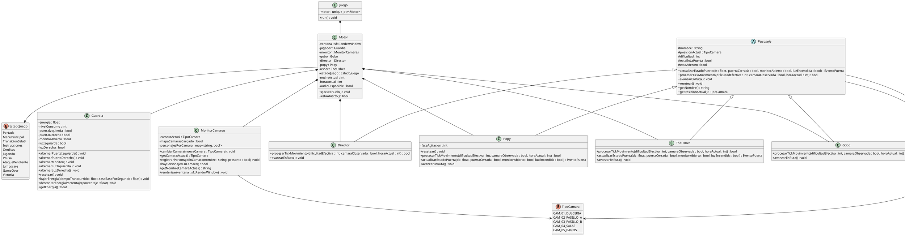

# Five Nights at Cinepolis

## Diagrama UML

```plantuml
@startuml
skinparam classAttributeIconSize 0

enum EstadoJuego {
    Portada
    MenuPrincipal
    TransicionSala3
    Instrucciones
    Creditos
    Jugando
    Pausa
    AtaquePendiente
    Jumpscare
    GameOver
    Victoria
}

enum TipoCamara {
    CAM_01_DULCERIA
    CAM_02_PASILLO_A
    CAM_03_PASILLO_B
    CAM_04_SALAS
    CAM_05_BANOS
}

enum EventoPuerta {
    Ninguno
    Golpe
    Entrada
}

class Juego {
    - motor : unique_ptr<Motor>
    + run() : void
}

class Motor {
    - ventana : sf::RenderWindow
    - jugador : Guardia
    - monitor : MonitorCamaras
    - gobo : Gobo
    - director : Director
    - popy : Popy
    - usher : TheUsher
    - estadoJuego : EstadoJuego
    - nocheActual : int
    - horaActual : int
    - audioDisponible : bool
    + ejecutarCiclo() : void
    + estaAbierto() : bool
}

class Guardia {
    - energia : float
    - nivelConsumo : int
    - puertaIzquierda : bool
    - puertaDerecha : bool
    - monitorAbierto : bool
    - luzIzquierda : bool
    - luzDerecha : bool
    + alternarPuertaIzquierda() : void
    + alternarPuertaDerecha() : void
    + alternarMonitor() : void
    + alternarLuzIzquierda() : void
    + alternarLuzDerecha() : void
    + resetear() : void
    + bajarEnergia(tiempoTranscurrido : float, tasaBasePorSegundo : float) : void
    + descontarEnergiaPorcentaje(porcentaje : float) : void
    + getEnergia() : float
}

class MonitorCamaras {
    - camaraActual : TipoCamara
    - mapaCamarasCargado : bool
    - personajesPorCamara : map<string, bool>
    + cambiarCamara(nuevaCamara : TipoCamara) : void
    + getCamaraActual() : TipoCamara
    + registrarPersonajeEnCamara(nombre : string, presente : bool) : void
    + hayPersonajesEnCamara() : bool
    + getNombreCamaraActual() : string
    + renderizar(ventana : sf::RenderWindow) : void
}

abstract class Personaje {
    # nombre : string
    # posicionActual : TipoCamara
    # dificultad : int
    # estaEnLaPuerta : bool
    # estaAdentro : bool
    + actualizarEstadoPuerta(dt : float, puertaCerrada : bool, monitorAbierto : bool, luzEncendida : bool) : EventoPuerta
    + procesarTickMovimiento(dificultadEfectiva : int, camaraObservada : bool, horaActual : int) : bool
    + avanzarEnRuta() : void
    + resetear() : void
    + getNombre() : string
    + getPosicionActual() : TipoCamara
}

class Gobo {
    + procesarTickMovimiento(dificultadEfectiva : int, camaraObservada : bool, horaActual : int) : bool
    + avanzarEnRuta() : void
}

class Director {
    + procesarTickMovimiento(dificultadEfectiva : int, camaraObservada : bool, horaActual : int) : bool
    + avanzarEnRuta() : void
}

class Popy {
    - faseAgitacion : int
    + resetear() : void
    + procesarTickMovimiento(dificultadEfectiva : int, camaraObservada : bool, horaActual : int) : bool
    + actualizarEstadoPuerta(dt : float, puertaCerrada : bool, monitorAbierto : bool, luzEncendida : bool) : EventoPuerta
    + avanzarEnRuta() : void
}

class TheUsher {
    + procesarTickMovimiento(dificultadEfectiva : int, camaraObservada : bool, horaActual : int) : bool
    + actualizarEstadoPuerta(dt : float, puertaCerrada : bool, monitorAbierto : bool, luzEncendida : bool) : EventoPuerta
    + avanzarEnRuta() : void
}

Juego *-- Motor
Motor *-- Guardia
Motor *-- MonitorCamaras
Motor *-- Gobo
Motor *-- Director
Motor *-- Popy
Motor *-- TheUsher

Motor --> EstadoJuego
MonitorCamaras --> TipoCamara
Personaje --> TipoCamara
Personaje --> EventoPuerta

Personaje <|-- Gobo
Personaje <|-- Director
Personaje <|-- Popy
Personaje <|-- TheUsher
@enduml
```
